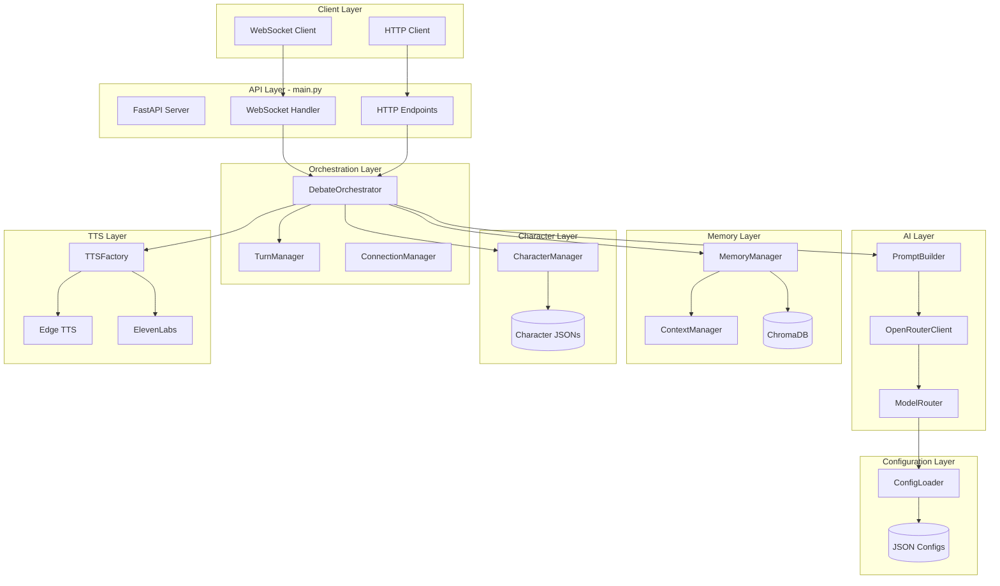

# AI-SYNTIA V4 - Backend Architecture Documentation

## Table of Contents

1. [System Overview](#system-overview)
2. [Architecture Diagram](#architecture-diagram)
3. [Directory Structure](#directory-structure)
4. [Core Components](#core-components)
5. [Data Flow](#data-flow)
6. [API Endpoints](#api-endpoints)
7. [Configuration System](#configuration-system)
8. [Design Patterns](#design-patterns)
9. [Key Technologies](#key-technologies)

---

## System Overview

AI-SYNTIA V4 is a **real-time AI debate system** that orchestrates multi-character debates with dynamic personalities, contextual memory, and text-to-speech synthesis. The backend is built on **FastAPI** with **WebSocket support** for real-time streaming, integrating **OpenRouter API** for AI responses and **ChromaDB** for semantic memory.

### Key Capabilities

- **Multi-character debates** with 1-3 AI personalities
- **Dynamic debate styles** (Formal, Casual, Heated, Balanced)
- **Long-term memory** using ChromaDB vector database
- **Real-time streaming** via WebSocket
- **TTS synthesis** with multiple engine support
- **Admin interventions** with priority handling
- **Context-aware prompting** with character personalities

---

## Architecture Diagram



---

## Directory Structure

```
backend/
├── main.py                      # FastAPI server & WebSocket handler
├── run_server.py                # Server launcher with Uvicorn
│
├── ai/                          # AI Integration Layer
│   ├── prompt_builder.py        # Constructs AI prompts
│   ├── openrouter_client.py     # OpenRouter API client
│   └── model_router.py          # Model selection logic
│
├── debate/                      # Debate Orchestration
│   ├── orchestrator.py          # Main debate coordinator
│   ├── turn_manager.py          # Turn rotation logic
│   └── debate_cycle.py          # (Legacy/unused)
│
├── memory/                      # Memory Management
│   ├── memory_manager.py        # ChromaDB interface
│   └── context_manager.py       # Short-term context
│
├── characters/                  # Character System
│   ├── character_manager.py     # Character loader
│   └── profiles/                # Character JSON definitions
│       ├── aria.json
│       ├── sera.json
│       └── eidon.json
│
├── config/                      # Configuration
│   ├── config_loader.py         # Config file loader
│   ├── system_config.json       # System settings
│   ├── ai_models.json           # Model configs
│   └── debate_settings.json     # Debate rules
│
├── tts/                         # Text-to-Speech
│   ├── tts_factory.py           # TTS engine selector
│   ├── edge_tts_engine.py       # Edge TTS (free)
│   └── elevenlabs_engine.py     # ElevenLabs (premium)
│
├── utils/                       # Utilities
│   └── debate_logger.py         # Debate persistence
│
├── data/                        # Runtime Data
│   └── chroma_db/               # Vector database storage
│
└── audio_output/                # Generated TTS audio
```

---

## Core Components

### 1. **main.py - API Server**

**Purpose**: Entry point for the backend, exposes HTTP and WebSocket endpoints.

**Key Responsibilities**:

- Serves REST API endpoints for health checks, character lists, config
- Manages WebSocket connections for real-time debate streaming
- Handles admin interventions via POST requests
- Integrates `DebateOrchestrator` for debate logic

**Important Classes**:

- `ConnectionManager`: Manages active WebSocket connections, broadcasts messages

**Key Endpoints**:

```python
GET  /                        # API info
GET  /api/health              # Health check
GET  /api/characters/list     # List all characters
POST /api/debate/start        # Start new debate (deprecated, use WS)
WS   /ws/debate               # WebSocket for real-time debates
POST /api/intervention        # Submit admin/audience intervention
```

---

### 2. **debate/orchestrator.py - DebateOrchestrator**

**Purpose**: Core orchestrator that manages the entire debate lifecycle.

**Key Methods**:

- `create_debate()`: Initializes a new debate session
- `stream_debate()`: Async generator that yields debate events in real-time
- `_generate_opening_statement()`: Creates character opening statements
- `_generate_debate_response()`: Generates AI responses during turns
- `_summarize_debate()`: Creates periodic debate summaries
- `post_intervention()`: Queues admin/audience interventions
- `_finalize_debate()`: Saves debate to long-term memory

**Debate Flow**:

1. Create debate → retrieve relevant memories
2. Generate opening statements (all characters)
3. Turn-by-turn dialogue (managed by `TurnManager`)
4. Periodic summarization (every 5 turns)
5. Handle interventions (priority queue)
6. Finalize → save to ChromaDB

**Intervention System**:

- Admin interventions have **priority 0** (highest)
- Audience interventions have **priority 1**
- Sorted queue ensures admin always goes first

---

### 3. **ai/prompt_builder.py - PromptBuilder**

**Purpose**: Constructs highly contextualized prompts for the AI model.

**Key Methods**:

- `build_opening_statement_prompt()`: Creates opening statement prompts
- `build_debate_prompt()`: Builds turn-by-turn debate prompts
- `build_summarization_prompt()`: Generates summarization prompts
- `_get_style_instructions()`: Injects debate style rules (formal/casual/heated)
- `_get_character_identity_prompt()`: Builds character personality
- `_format_memories()`: Formats retrieved memories for context

**Prompt Structure**:

```
[CHARACTER IDENTITY]
    - Name, role, personality traits
    - Tone, vibe, empathy/sarcasm levels
    - Signature phrases

[DEBATE CONTEXT]
    - Topic
    - Fellow debaters (profiles)
    - Relevant past memories

[DEBATE HISTORY]
    - Summary of key arguments
    - Recent conversation (last N messages)

[STYLE INSTRUCTIONS]
    - Formality level (formal/casual/balanced)
    - Emotion sensitivity (calm/heated)

[INTERVENTION] (if present)
    - Admin/Audience message
    - Critical instruction to address it

[RESPONSE REQUIREMENTS]
    - Address other debaters by name
    - Build on recent points
    - Stay in character
    - NO REPETITION
```

**Dynamic Admin Name**:

- Formal debates → "ARCHITECT"
- Casual debates → "EDY"
- Balanced debates → "ARCHITECT EDY"

---

### 4. **ai/openrouter_client.py - OpenRouterClient**

**Purpose**: Handles communication with OpenRouter API.

**Key Features**:

- Retrieves API key from environment
- Applies model parameters (temperature, penalties)
- Uses **frequency_penalty** and **presence_penalty** to reduce repetition
- Fallback to test response if no API key

**Parameters** (from `ai_models.json`):

```json
{
  "default": {
    "temperature": 0.8,
    "top_p": 0.9,
    "frequency_penalty": 0.3,
    "presence_penalty": 0.3
  }
}
```

---

### 5. **ai/model_router.py - ModelRouter**

**Purpose**: Selects appropriate AI model based on topic and budget tier.

**Selection Logic**:

1. Check topic category (philosophical, technical, casual, etc.)
2. Get budget tier (free, basic, premium)
3. Return topic-specific model for that tier
4. Fallback to tier default if no topic mapping

**Example**:

- Topic: "AI Ethics" → Category: `ai_ethics`
- Tier: `free` → Model: `gryphe/mythomax-l2-13b`

---

### 6. **memory/memory_manager.py - MemoryManager**

**Purpose**: Manages long-term memory using ChromaDB vector database.

**Key Methods**:

- `save_memory()`: Stores debate summary with embeddings
- `search_memory()`: Semantic search for relevant past debates
- `_generate_embedding()`: Creates vector embeddings (sentence-transformers)

**Memory Storage**:

```python
{
  "id": "uuid",
  "text": "Debate summary in Gen Z slang",
  "metadata": {
    "topic": "AI Ethics",
    "created_at": "2025-11-24T10:00:00Z",
    "participants": ["Aria", "Sera"]
  }
}
```

**Semantic Search**:

- User starts debate on "AI Ethics"
- ChromaDB finds 5 most relevant past debates
- Memories injected into prompt for context continuity

---

### 7. **memory/context_manager.py - ContextManager**

**Purpose**: Manages short-term conversation context (in-memory).

**Key Methods**:

- `create_debate_context()`: Initializes context for new debate
- `add_message()`: Appends message to history
- `get_recent_messages()`: Retrieves last N messages
- `get_full_context()`: Returns entire conversation

**Context Structure**:

```python
{
  "debate_id": {
    "messages": [
      {
        "character_id": "aria",
        "character_name": "Aria",
        "text": "AI ethics is...",
        "timestamp": "2025-11-24T10:01:00Z"
      }
    ]
  }
}
```

---

### 8. **characters/character_manager.py - CharacterManager**

**Purpose**: Loads and manages character profiles from JSON files.

**Key Methods**:

- `load_characters()`: Reads all character JSONs
- `get_character_by_id()`: Retrieves single character
- `get_characters_by_ids()`: Retrieves multiple characters
- `list_characters()`: Returns all available characters

**Character Schema**:

```json
{
  "id": "aria",
  "name": "Aria",
  "role": "The Empathetic AI",
  "meta": {
    "description": "AI rights advocate...",
    "avatar": "aria.png",
    "model_file": "aria/model3.json"
  },
  "personality": {
    "tone": "warm",
    "attitude": "compassionate",
    "vibe": "supportive friend"
  },
  "behavior": {
    "empathy_level": 0.9,
    "sarcasm_level": 0.1,
    "interruption_tendency": 0.3
  },
  "style": {
    "signature_phrases": ["I feel like...", "Let's consider..."]
  }
}
```

---

### 9. **config/config_loader.py - ConfigLoader**

**Purpose**: Centralized configuration management.

**Key Methods**:

- `get_budget_tier()`: Returns current tier (free/basic/premium)
- `get_ai_config()`: Returns AI settings for tier
- `get_tts_config()`: Returns TTS settings for tier
- `get_debate_settings()`: Returns debate flow rules
- `get_model_parameters()`: Returns generation parameters
- `get_openrouter_key()`: Returns API key from `.env`

**Configuration Files**:

1. **system_config.json**: Budget tiers, TTS/AI configs
2. **ai_models.json**: Model mappings, parameters
3. **debate_settings.json**: Debate flow, styles, interruptions

---

### 10. **tts/tts_factory.py - TTSFactory**

**Purpose**: Factory pattern for selecting TTS engine.

**Supported Engines**:

- **Edge TTS** (Free) - Microsoft Edge TTS API
- **ElevenLabs** (Premium) - High-quality voice synthesis

**Selection Logic**:

- Checks budget tier from config
- Returns appropriate engine instance
- Falls back to Edge TTS if premium unavailable

---

### 11. **utils/debate_logger.py - DebateLogger**

**Purpose**: Persists debates to JSON files.

**Key Functions**:

- `save_debate_log()`: Saves debate to `DebateSaved/` directory
- `get_debate_log_path()`: Returns path for debate file

**Saved Data**:

```json
{
  "debate_id": "uuid",
  "topic": "AI Ethics",
  "participants": ["Aria", "Sera"],
  "messages": [...],
  "created_at": "2025-11-24T10:00:00Z",
  "ended_at": "2025-11-24T10:15:00Z"
}
```

---

## Data Flow

### Debate Start Flow

```
1. Client sends WebSocket message:
   {
     "type": "start_debate",
     "data": {
       "topic": "AI Ethics",
       "character_ids": ["aria", "sera"],
       "style": "formal",
       "allow_interruptions": false
     }
   }

2. WebSocket Handler → DebateOrchestrator.create_debate()
   - Validates character_ids
   - Retrieves characters from CharacterManager
   - Searches MemoryManager for relevant past debates
   - Creates debate object with context

3. DebateOrchestrator.stream_debate()
   - Yields "debate_started" event
   - For each character:
     a. PromptBuilder.build_opening_statement_prompt()
     b. OpenRouterClient.generate() → AI response
     c. TTSFactory.synthesize() → Audio file
     d. Yields "opening_statement" event

4. Turn-by-turn dialogue:
   - TurnManager.get_next_speaker() → Selects character
   - PromptBuilder.build_debate_prompt() → With full context
   - OpenRouterClient.generate() → AI response
   - Yields "character_response" event
   - ContextManager.add_message() → Updates history

5. Every 5 turns:
   - DebateOrchestrator._summarize_debate()
   - Yields "debate_summary" event

6. If intervention queued:
   - Yields "intervention" event
   - Next character MUST address it

7. On debate end:
   - DebateOrchestrator._finalize_debate()
   - MemoryManager.save_memory() → ChromaDB
   - DebateLogger.save_debate_log() → JSON file
   - Yields "debate_ended" event
```

### Memory Retrieval Flow

```
1. DebateOrchestrator.create_debate()
   ↓
2. MemoryManager.search_memory(topic)
   ↓
3. Generate embedding for topic
   ↓
4. ChromaDB.query(embedding, top_k=5)
   ↓
5. Returns 5 most similar past debates
   ↓
6. Inject into prompt via PromptBuilder
   ↓
7. AI receives context: "You recall from previous debates: ..."
```

---

## API Endpoints

### WebSocket: `/ws/debate`

**Connection Flow**:

1. Client connects
2. Server sends `connection_established`
3. Client sends `start_debate` command
4. Server streams events:
   - `debate_started`
   - `opening_statement` (x N characters)
   - `character_response` (x M turns)
   - `debate_summary` (periodic)
   - `intervention` (if admin/audience posts)
   - `debate_ended`

**Event Format**:

```json
{
  "type": "character_response",
  "data": {
    "character_id": "aria",
    "character_name": "Aria",
    "text": "I believe AI ethics...",
    "audio_path": "/audio_output/aria_1732445123.mp3",
    "timestamp": "2025-11-24T10:05:23Z"
  }
}
```

### HTTP Endpoints

```python
GET  /api/characters/list
Response:
{
  "characters": [
    {
      "id": "aria",
      "name": "Aria",
      "role": "The Empathetic AI",
      "avatar": "aria.png"
    }
  ]
}

POST /api/intervention
Body:
{
  "debate_id": "uuid",
  "text": "What about privacy concerns?",
  "source": "admin",  # or "audience"
  "user_name": "Architect"
}
Response:
{
  "queue_position": 0,
  "priority": 0
}
```

---

## Configuration System

### Budget Tiers

The system supports 3 tiers, configured via `.env`:

```env
BUDGET_TIER=free  # or "basic" or "premium"
```

**Tier Configuration** (`system_config.json`):

```json
{
  "free": {
    "models": ["x-ai/grok-4-fast"],
    "max_tokens": 700,
    "temperature": 0.8,
    "tts_engine": "edge"
  },
  "premium": {
    "models": ["anthropic/claude-haiku-4.5"],
    "max_tokens": 700,
    "temperature": 0.8,
    "tts_engine": "elevenlabs"
  }
}
```

### Debate Styles

Configured in `debate_settings.json`:

```json
{
  "debate_styles": {
    "formal": {
      "formality": 0.9,
      "emotion_sensitivity": 0.6,
      "interruption_multiplier": 0.3
    },
    "casual": {
      "formality": 0.4,
      "emotion_sensitivity": 0.8,
      "interruption_multiplier": 1.2
    },
    "heated": {
      "formality": 0.3,
      "emotion_sensitivity": 1.5,
      "interruption_multiplier": 2.0
    }
  }
}
```

**Style Effects**:

- **Formality ≥ 0.8**: AI uses academic language, no slang
- **Formality ≤ 0.4**: AI uses Gen Z slang ("fr", "cooked", "no cap")
- **Emotion Sensitivity > 1.2**: AI is heated and emotional
- **Emotion Sensitivity < 0.5**: AI is calm and logical

---

## Design Patterns

### 1. **Factory Pattern**

- `TTSFactory`: Creates TTS engine based on config tier

### 2. **Strategy Pattern**

- `ModelRouter`: Selects model based on topic + tier strategy

### 3. **Singleton Pattern**

- `ConfigLoader`: Single instance manages all configs
- `CharacterManager`: Single instance loads characters once

### 4. **Observer Pattern**

- WebSocket clients observe debate events
- `ConnectionManager` broadcasts to all observers

### 5. **Dependency Injection**

- `DebateOrchestrator` receives dependencies in constructor:
  ```python
  def __init__(self, character_manager, config_loader):
      self.character_manager = character_manager
      self.config_loader = config_loader
      self.memory_manager = MemoryManager()
      # ...
  ```

### 6. **Async Generator Pattern**

- `stream_debate()`: Yields events as they occur
  ```python
  async def stream_debate(...) -> AsyncGenerator[Dict, None]:
      yield {"type": "debate_started", ...}
      # ...
  ```

---

## Key Technologies

| Technology                | Purpose                        | Version |
| ------------------------- | ------------------------------ | ------- |
| **FastAPI**               | Web framework                  | Latest  |
| **Uvicorn**               | ASGI server                    | Latest  |
| **ChromaDB**              | Vector database for memory     | Latest  |
| **OpenRouter**            | AI model API gateway           | API v1  |
| **Edge TTS**              | Free text-to-speech            | Latest  |
| **ElevenLabs**            | Premium TTS (optional)         | API v1  |
| **sentence-transformers** | Embeddings for semantic search | Latest  |
| **aiohttp**               | Async HTTP client              | Latest  |
| **python-dotenv**         | Environment variables          | Latest  |

---

## Environment Variables

Required in `.env`:

```env
# API Keys
OPENROUTER_API_KEY=your_key_here
ELEVENLABS_API_KEY=your_key_here  # Optional

# System Config
BUDGET_TIER=free  # or basic/premium

# Optional
OPENROUTER_BASE_URL=https://openrouter.ai/api/v1
```

---

## Deployment Notes

### Running the Server

```bash
# Install dependencies
pip install -r requirements.txt

# Start server
python run_server.py
```

**Server starts on**: `http://0.0.0.0:8000`

### Production Considerations

1. **ChromaDB Persistence**: Stored in `data/chroma_db/` - ensure this directory persists
2. **Audio Files**: Generated in `audio_output/` - consider cleanup strategy
3. **WebSocket Limits**: Set appropriate connection limits in production
4. **API Rate Limits**: OpenRouter has rate limits - implement retry logic
5. **TTS Caching**: Consider caching TTS audio for repeated phrases

---

## Summary

AI-SYNTIA V4's backend is a **modular, event-driven system** designed for real-time AI debates. Key architectural strengths:

1. **Separation of Concerns**: Clear layers (API, Orchestration, AI, Memory)
2. **Configurability**: Tier-based configs for flexible deployment
3. **Extensibility**: Factory patterns make it easy to add new TTS engines or models
4. **Memory**: ChromaDB enables semantic context from past debates
5. **Real-time**: WebSocket streaming provides immediate feedback
6. **Character Depth**: Rich personality system creates distinct debate voices

The system can scale from a **single-character monologue** to **multi-character heated debates** with **admin interventions** and **long-term memory recall**.
