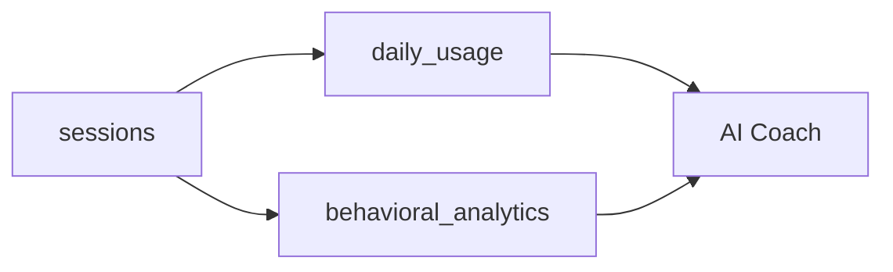

# Metrics API Endpoints - Frontend Implementation Guide

## Overview

These endpoints enable the frontend to track student session time and behavioral analytics. All endpoints require student authentication.

---

## Authentication

All endpoints require a valid student JWT token in the `Authorization` header:

```
Authorization: Bearer <student_token>
```

---

## Endpoints

### 1. Start Session (Optional)

**Endpoint:** `POST /api/metrics/session/start`

**Purpose:** Explicitly start a new tracking session when the student logs in.

**Request Body:**

```json
{
  "device_info": "Chrome/Windows" // Optional
}
```

**Response:**

```json
{
  "status": "success",
  "session_token": "uuid-string"
}
```

**When to call:** On student login or app initialization.

---

### 2. Heartbeat (Required)

**Endpoint:** `POST /api/metrics/heartbeat`

**Purpose:** Update session activity and accumulate study time. Call this every 60 seconds while the student is active.

**Request Body:**

```json
{
  "active_time_seconds": 60, // Time since last heartbeat (usually 60)
  "page_url": "/lesson/USMAT04U01C01L01" // Optional, current page
}
```

**Response:**

```json
{
  "status": "success"
}
```

**When to call:**

- Every 60 seconds via `setInterval`
- Only when the tab is active (check `document.visibilityState`)

**Implementation Note:**
If no active session exists, the backend will automatically create one.

---

### 3. End Session (Optional)

**Endpoint:** `POST /api/metrics/session/end`

**Purpose:** Explicitly close the current session when the student logs out.

**Request Body:**

```json
{
  "reason": "logout" // Optional: "logout", "timeout", "close"
}
```

**Response:**

```json
{
  "status": "success"
}
```

**When to call:**

- On logout button click
- In `beforeunload` event (browser close/tab close)

---

### 4. Record Behavior (Required for Lessons)

**Endpoint:** `POST /api/metrics/behavior`

**Purpose:** Send behavioral analytics data collected during a lesson.

**Request Body:**

```json
{
  "lesson_id": "USMAT04U01C01L01",
  "focus_score": 0.85, // 0.0 to 1.0 (% of time focused)
  "engagement_level": "high", // "high", "medium", "low"
  "help_requests": 3, // Number of hints clicked
  "hesitation_count": 2, // Number of long pauses
  "tab_switches": 5 // Number of times tab lost focus
}
```

**Response:**

```json
{
  "status": "success"
}
```

**When to call:**

- When submitting lesson results
- Or periodically during long lessons (every 5 minutes)

---

## Implementation Checklist

### Phase 1: Session Tracking (High Priority)

- [ ] Create `metricsService.js` with heartbeat logic
- [ ] Start heartbeat timer on login (60s interval)
- [ ] Stop heartbeat on logout
- [ ] Pause heartbeat when tab is hidden (`visibilitychange` event)
- [ ] Call `/session/end` on `beforeunload`

### Phase 2: Behavioral Tracking (Medium Priority)

- [ ] Track `visibilitychange` events during lessons
- [ ] Calculate focus score (time visible / total time)
- [ ] Track hint button clicks
- [ ] Detect hesitation (time before first answer attempt)
- [ ] Send data to `/behavior` on lesson completion

---

## Example: Heartbeat Implementation

```javascript
// metricsService.js
let heartbeatInterval = null;

export function startHeartbeat() {
  if (heartbeatInterval) return; // Already running

  heartbeatInterval = setInterval(async () => {
    if (document.visibilityState === "visible") {
      await fetch("/api/metrics/heartbeat", {
        method: "POST",
        headers: {
          Authorization: `Bearer ${getToken()}`,
          "Content-Type": "application/json",
        },
        body: JSON.stringify({
          active_time_seconds: 60,
          page_url: window.location.pathname,
        }),
      });
    }
  }, 60000); // Every 60 seconds
}

export function stopHeartbeat() {
  if (heartbeatInterval) {
    clearInterval(heartbeatInterval);
    heartbeatInterval = null;
  }
}
```

---

## Example: Focus Tracking

```javascript
// In LessonView.vue
let focusStartTime = Date.now();
let totalFocusTime = 0;
let tabSwitches = 0;

document.addEventListener("visibilitychange", () => {
  if (document.visibilityState === "hidden") {
    totalFocusTime += Date.now() - focusStartTime;
    tabSwitches++;
  } else {
    focusStartTime = Date.now();
  }
});

// On lesson submit:
const lessonDuration = Date.now() - lessonStartTime;
const focusScore = totalFocusTime / lessonDuration;

await fetch("/api/metrics/behavior", {
  method: "POST",
  body: JSON.stringify({
    lesson_id: currentLessonId,
    focus_score: focusScore,
    engagement_level: calculateEngagement(),
    help_requests: hintClickCount,
    hesitation_count: hesitationCount,
    tab_switches: tabSwitches,
  }),
});
```

---

## Testing

### Manual Testing

1. **Heartbeat:** Login, wait 2 minutes, check database `daily_usage` table for ~2 minutes added
2. **Focus:** Complete a lesson, switch tabs 3 times, verify `behavioral_analytics` has `focus_score < 1.0`
3. **Session End:** Logout, verify `sessions` table has `ended_at` timestamp

### Database Verification

```sql
-- Check today's usage
SELECT * FROM daily_usage WHERE student_id = 3 AND usage_date = CURDATE();

-- Check recent behavioral data
SELECT * FROM behavioral_analytics WHERE student_id = 3 ORDER BY recorded_at DESC LIMIT 5;

-- Check active sessions
SELECT * FROM sessions WHERE student_id = 3 AND is_active = 1;
```

---

## Database Schema

### Overview

The metrics system uses three main tables to track student activity:



### 1. `sessions` Table

**Purpose:** Track individual study sessions with start/end times.

| Column          | Type         | Description                | Updated By       |
| --------------- | ------------ | -------------------------- | ---------------- |
| `id`            | INT          | Primary key                | Auto             |
| `student_id`    | INT          | Foreign key to student     | `/session/start` |
| `session_token` | VARCHAR(36)  | Unique session UUID        | `/session/start` |
| `is_active`     | BOOLEAN      | Whether session is ongoing | `/session/end`   |
| `started_at`    | TIMESTAMP    | When session began         | `/session/start` |
| `last_activity` | TIMESTAMP    | Last heartbeat received    | `/heartbeat`     |
| `ended_at`      | TIMESTAMP    | When session closed        | `/session/end`   |
| `device_info`   | VARCHAR(255) | Browser/device info        | `/session/start` |

**Data Flow:**

1. **Start:** `POST /session/start` creates a new row with `is_active=True`
2. **Heartbeat:** `POST /heartbeat` updates `last_activity` every 60s
3. **End:** `POST /session/end` sets `is_active=False` and `ended_at`

**Used By AI Coach:**

- Calculate session duration: `ended_at - started_at`
- Detect "long sessions" (> 2 hours) to suggest breaks

---

### 2. `daily_usage` Table

**Purpose:** Aggregate daily study time for time limits and consistency tracking.

| Column               | Type      | Description                         | Updated By                  |
| -------------------- | --------- | ----------------------------------- | --------------------------- |
| `id`                 | INT       | Primary key                         | Auto                        |
| `student_id`         | INT       | Foreign key to student              | Auto                        |
| `usage_date`         | DATE      | The calendar day (e.g., 2025-11-29) | Auto                        |
| `total_minutes`      | INT       | Accumulated study time in minutes   | `/heartbeat`                |
| `session_count`      | INT       | Number of sessions started today    | `/session/start`            |
| `lessons_completed`  | INT       | Lessons finished today              | (Future: lesson completion) |
| `questions_answered` | INT       | Total questions answered            | (Future: question tracking) |
| `last_updated`       | TIMESTAMP | Last modification time              | `/heartbeat`                |

**Data Flow:**

1. **First Heartbeat of Day:** Creates a new row for `usage_date = today()`
2. **Subsequent Heartbeats:** Adds `active_time_seconds / 60` to `total_minutes`
3. **Daily Reset:** New row created automatically the next day

**Used By AI Coach:**

- **Consistency:** "You've studied 5 days in a row!"
- **Effort Recognition:** "You've studied for 2 hours today!"
- **Time Limits:** Parents can set daily limits (e.g., 60 min/day)

**Example Query:**

```sql
-- Get last 7 days of usage
SELECT usage_date, total_minutes
FROM daily_usage
WHERE student_id = 3
  AND usage_date >= DATE_SUB(CURDATE(), INTERVAL 7 DAY)
ORDER BY usage_date DESC;
```

---

### 3. `behavioral_analytics` Table

**Purpose:** Track focus, engagement, and learning behaviors during lessons.

| Column             | Type         | Description                              | Updated By  |
| ------------------ | ------------ | ---------------------------------------- | ----------- |
| `id`               | INT          | Primary key                              | Auto        |
| `student_id`       | INT          | Foreign key to student                   | `/behavior` |
| `session_id`       | INT          | Foreign key to session                   | `/behavior` |
| `lesson_id`        | VARCHAR(50)  | Lesson being studied                     | `/behavior` |
| `recorded_at`      | TIMESTAMP    | When data was recorded                   | `/behavior` |
| `focus_score`      | DECIMAL(3,2) | 0.00 to 1.00 (% of time focused)         | `/behavior` |
| `engagement_level` | VARCHAR(20)  | "high", "medium", "low"                  | `/behavior` |
| `help_requests`    | INT          | Number of hints clicked                  | `/behavior` |
| `hesitation_count` | INT          | Number of long pauses                    | `/behavior` |
| `stopped_early`    | BOOLEAN      | Did student quit mid-lesson?             | `/behavior` |
| `ai_observations`  | JSON         | Extra data (e.g., `{"tab_switches": 5}`) | `/behavior` |

**Data Flow:**

1. **During Lesson:** Frontend tracks focus events (tab switches, idle time)
2. **On Lesson Submit:** `POST /behavior` sends aggregated metrics
3. **Storage:** One row per lesson attempt

**Used By AI Coach:**

- **Focus Issues:** "I noticed you switched tabs 5 times. Try to minimize distractions."
- **Help Seeking:** "You're asking for hints often. Let's review the theory."
- **Engagement:** "You seem disengaged. Want to try a different lesson?"

**Example Query:**

```sql
-- Get average focus score for last 10 lessons
SELECT AVG(focus_score) as avg_focus
FROM behavioral_analytics
WHERE student_id = 3
ORDER BY recorded_at DESC
LIMIT 10;
```

---

## Data Lifecycle Example

### Scenario: Student completes a 15-minute lesson

1. **Login (10:00 AM)**

   - `POST /session/start` → Creates `sessions` row (id=123, is_active=True)
   - Creates `daily_usage` row for today if it doesn't exist

2. **Heartbeat #1 (10:01 AM)**

   - `POST /heartbeat` (60 seconds active)
   - Updates `sessions.last_activity = 10:01`
   - Adds 1 minute to `daily_usage.total_minutes`

3. **Heartbeat #2-15 (10:02-10:15 AM)**

   - Each heartbeat adds 1 minute to `daily_usage.total_minutes`
   - `sessions.last_activity` keeps updating

4. **Lesson Complete (10:15 AM)**

   - `POST /behavior` → Creates `behavioral_analytics` row:
     ```json
     {
       "lesson_id": "USMAT04U01C01L01",
       "focus_score": 0.92,
       "engagement_level": "high",
       "help_requests": 2,
       "hesitation_count": 1,
       "ai_observations": { "tab_switches": 1 }
     }
     ```

5. **Logout (10:20 AM)**
   - `POST /session/end` → Sets `sessions.is_active = False`, `ended_at = 10:20`

**Final State:**

- `sessions`: 1 row (20 min duration)
- `daily_usage`: `total_minutes = 20`
- `behavioral_analytics`: 1 row for the lesson

---

## Notes

- **Heartbeat Frequency:** 60 seconds is recommended. Shorter intervals increase server load.
- **Focus Score:** Calculate as `(time_tab_visible / total_lesson_time)`. Perfect focus = 1.0.
- **Engagement Level:** Suggest "high" if user interacts every 30s, "medium" if every 60s, "low" otherwise.
- **Error Handling:** If a heartbeat fails, don't stop the timer. The next heartbeat will catch up.
